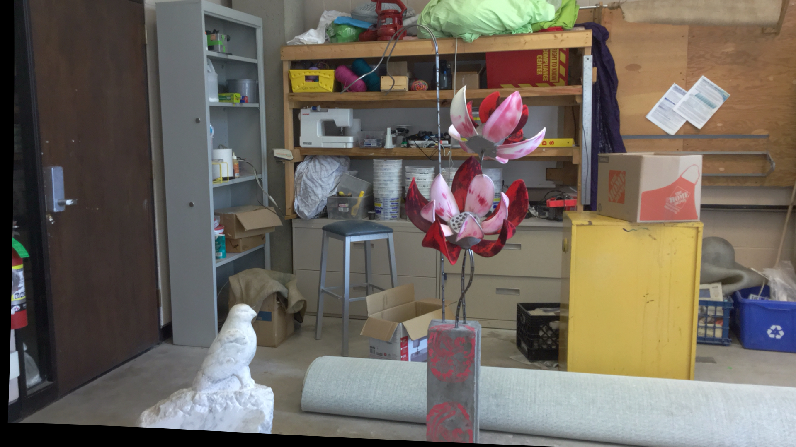
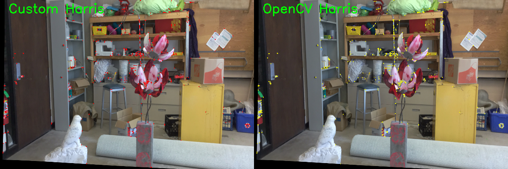
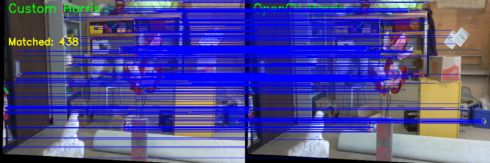

# Harris-Corner-Detection-Comparison-Custom-vs-OpenCV
Comparison between a manually implemented Harris Corner Detector and OpenCV's built-in Harris function using Python and OpenCV.

---

##  Abstract

Corner detection is a fundamental problem in computer vision used for feature extraction, image matching, and scene understanding.  
This project presents a comparative study between a **manually implemented Harris Corner Detector** and the **OpenCV built-in implementation**.

The goal is to analyze:
- Detection consistency
- Robustness to noise
- Spatial agreement between detected keypoints

Additionally, a matching procedure is applied to evaluate the correspondence between both methods.

---

##  Methodology

The pipeline consists of four main stages:

### 1. Image Preprocessing
- Convert input image to grayscale  
- Compute intensity gradients using Sobel filters  

### 2. Custom Harris Detector
- Compute image gradients (Ix, Iy)  
- Construct structure tensor:
  - Ix², Iy², Ix·Iy  
- Apply Gaussian smoothing  
- Compute Harris response function  
- Apply Non-Maximum Suppression (NMS)  

### 3. OpenCV Harris Detector
- Use `cv2.cornerHarris`  
- Apply thresholding  
- Apply local NMS for corner selection  

### 4. Feature Matching
- Scale keypoints to visualization space  
- Match spatially close corners  
- Draw correspondences between methods  

---

##  Methodology Diagram

---

##  Mathematical Formulation

### 1. Image Gradients
\[
I_x = \frac{\partial I}{\partial x}, \quad I_y = \frac{\partial I}{\partial y}
\]

---

### 2. Structure Tensor

\[
M =
\begin{bmatrix}
I_x^2 & I_x I_y \\
I_x I_y & I_y^2
\end{bmatrix}
\]

Smoothed using Gaussian filter:

\[
S = G_\sigma * M
\]

---

### 3. Harris Response Function

\[
R = \det(S) - k \cdot (\text{trace}(S))^2
\]

Where:
- \( \det(S) = S_{xx}S_{yy} - S_{xy}^2 \)
- \( \text{trace}(S) = S_{xx} + S_{yy} \)
- \( k \approx 0.04 \)

---

##  Discussion

### 1. Detection Differences
The custom implementation is more sensitive to noise due to manual construction of the structure tensor.  
OpenCV version is more stable because it uses optimized Gaussian filtering and internal enhancements.

### 2. Corner Distribution
Both methods detect similar high-intensity corner regions.  
OpenCV produces slightly more consistent and dense detections.

### 3. Matching Analysis
Spatial matching shows a high overlap between both methods.  
Small differences arise due to smoothing and thresholding variations.

### 4. Limitations
- Manual NMS is computationally slow  
- Matching is based on spatial proximity only, not descriptor similarity  

---

##  Results

### Input Image

---

### Detection Comparison

---

### Matching Visualization

---

##  Conclusion

Both implementations demonstrate the effectiveness of the Harris corner detector.  

- Custom implementation → educational and interpretable  
- OpenCV implementation → optimized and robust  

---

##  Author

Aya Kheir Beq MSc in Mechatronics Engineering Focus: Computer Vision, Robotics, Intelligent Systems
